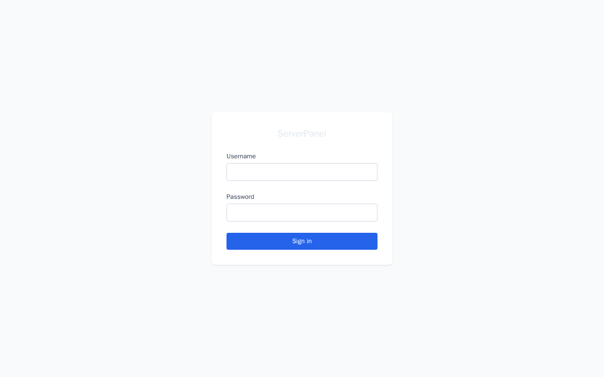
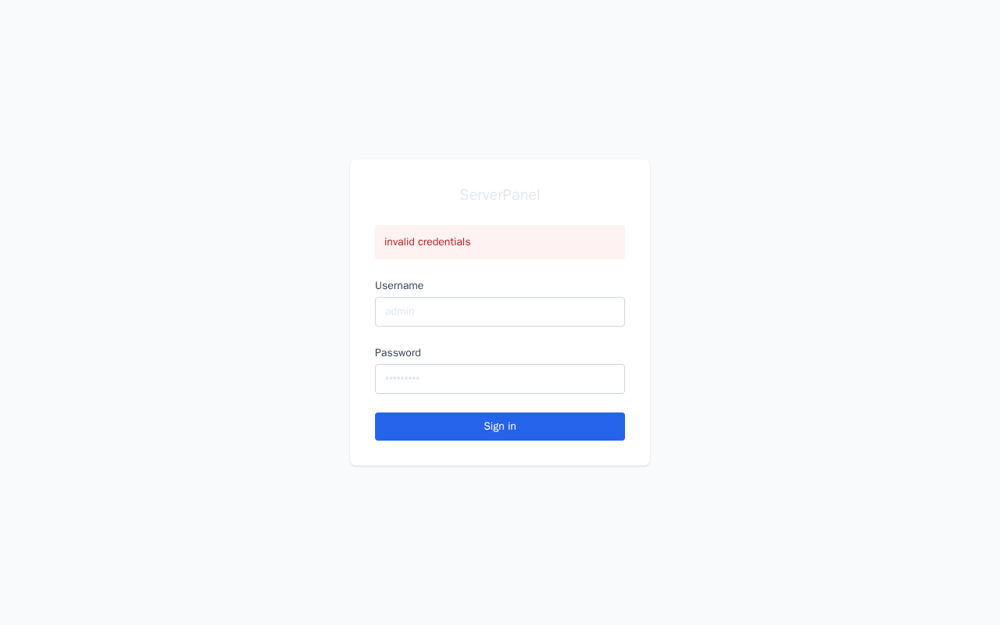
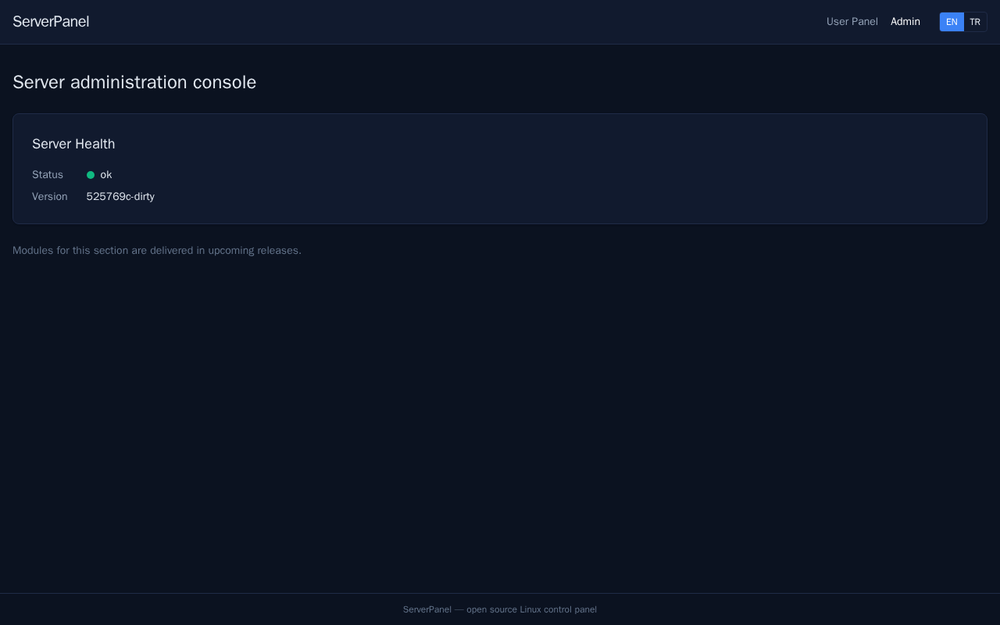
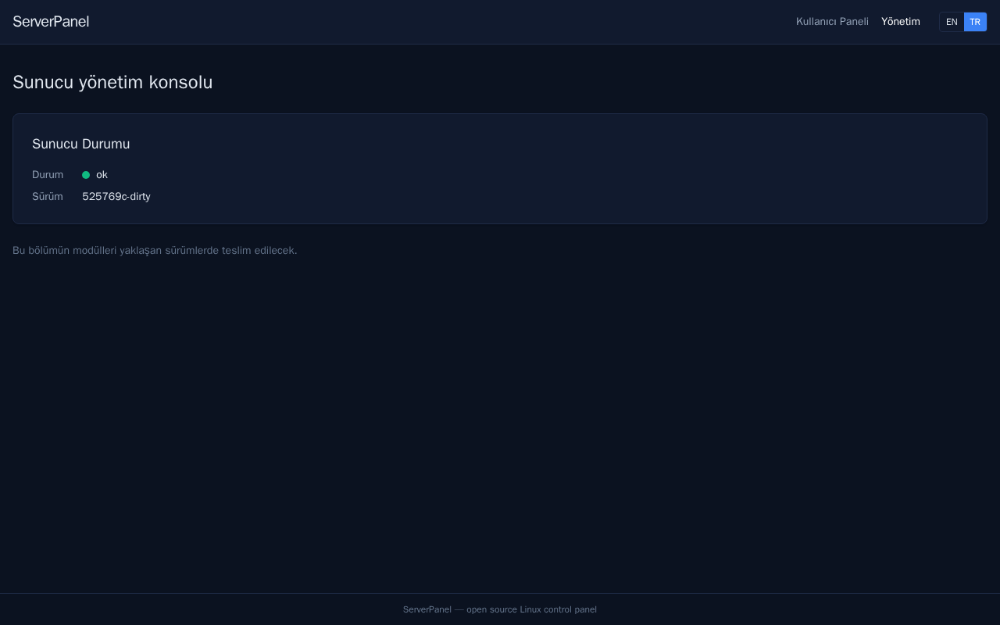

# ServerPanel

Open-source Linux server control panel — functionally referenced against
cPanel/WHM, with original code, UI and naming.

**Status:** early development (Phase 0). See [PLAN.md](PLAN.md) for the roadmap,
[TASKS.md](TASKS.md) for live task status and [DECISIONS.md](DECISIONS.md) for
architecture rationale.

## Architecture

- `panel-api` — public HTTP API + SPA host; runs unprivileged.
- `panel-agent` — privileged root helper; Unix socket, strict operation whitelist.
- `panelctl` — operator CLI (install bootstrap, diagnostics).
- `web/` — React 18 + TypeScript + Vite + Tailwind frontends (`/` user, `/admin` admin).

## Screenshots

- 
- 
- 
- 
- 

## Development

```sh
make deps      # toolchain + npm dependencies
make lint      # golangci-lint + eslint + tsc + gofmt check
make test      # Go unit tests + Vitest
make build     # binaries + production frontend bundle
make itest     # integration tests in systemd-enabled containers
make e2e       # Playwright E2E against a real panel-api instance
make smoke     # clean-container install.sh smoke test
make verify    # the main gate: all of the above
```

## Requirements

- Go 1.25+
- Node.js 24+
- Docker (integration/E2E/smoke targets)
- GNU Make (on Windows: `winget install ezwinports.make`, recipes run under Git Bash sh)

## License

To be decided before first public release.
